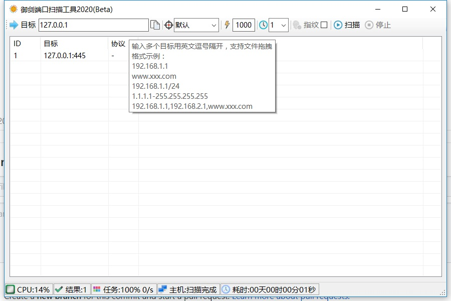

一个基于.NET + IOCP模型开发的高效端口扫描工具，主动进行区间合并，端口区间合并，端口指纹深度探测

<h2>更新日期：2020年02月12日</h2>
<h3>依赖：Net Framework 4.0  解压密码：1</h3>
<h4>+修复上一个beta版本容易崩溃的问题</h4>
<h4>+支持更高的socket IOCP叠加缓冲区</h4>
<h4>+优化CPU占用、优化内存占用</h4>
<h4>+增加文件拖拽</h4>
<h4>+支持更加复杂的数据输入格式</h4>
<h4>+界面一些基本的调整</h4>

